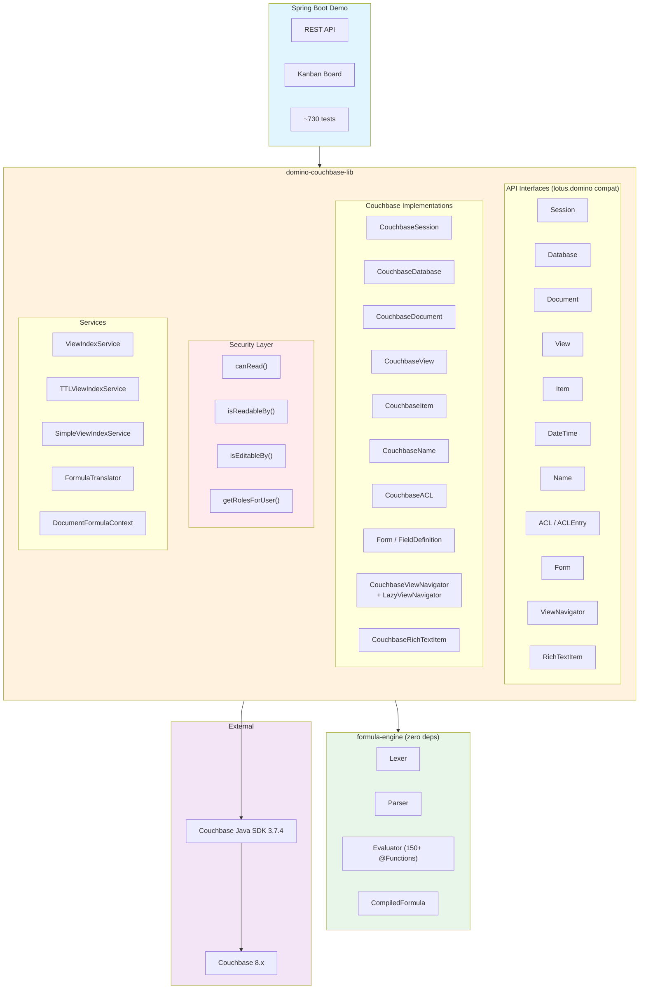

# DomCouch — HCL Domino 14.5 Java API on Couchbase

> **"Write once against the Domino API, run forever on Couchbase."**

## Architecture



## Build & Install

### Maven Dependency Chain

```
formula-engine ──────► domino-couchbase-lib ──────► springboot-demo
(zero external deps)   (Couchbase SDK + Jackson)    (Spring Boot + REST)
```

The root `pom.xml` defines the three modules in build order. A single
`mvn install` from the project root builds them sequentially and installs
each JAR into your local Maven repository (`~/.m2`).

### One-Command Full Build

```bash
cd domcouch
mvn clean install
```

This runs all 664 tests and installs all three artifacts:

| Module                 | Artifact                                           | Notes                           |
| ---------------------- | -------------------------------------------------- | ------------------------------- |
| `formula-engine`       | `com.domcouch:formula-engine:0.3.0-SNAPSHOT`       | Zero external deps              |
| `domino-couchbase-lib` | `com.domcouch:domino-couchbase-lib:0.3.0-SNAPSHOT` | Depends on formula-engine       |
| `springboot-demo`      | `com.domcouch:springboot-demo:0.3.0-SNAPSHOT`      | Depends on domino-couchbase-lib |

### Build Without Tests

```bash
mvn clean install -DskipTests
```

### Build a Single Module (with dependencies)

Maven resolves inter-module dependencies from the reactor or local `~/.m2`.
Build the parent first, then the module you want:

```bash
# First install the dependencies
mvn install -pl formula-engine -DskipTests
mvn install -pl domino-couchbase-lib -DskipTests

# Then build just the demo
mvn install -pl springboot-demo
```

Or use `-am` (also-make) to automatically build required modules:

```bash
mvn install -pl springboot-demo -am
```

### Run Tests Only

```bash
mvn test -pl formula-engine           # 466 formula engine tests
mvn test -pl domino-couchbase-lib     # domain-logic tests
```

### Using formula-engine as a Standalone Dependency

Because `formula-engine` has **zero external dependencies** (only JUnit 5 for
tests), you can use it in any Java project:

```xml
<dependency>
    <groupId>com.domcouch</groupId>
    <artifactId>formula-engine</artifactId>
    <version>0.3.0-SNAPSHOT</version>
</dependency>
```

## Quick Start

### 1. Start Couchbase

```bash
docker compose up -d
```

Wait ~60s for the Couchbase cluster to initialize. Check the web console at
http://localhost:8091 (user: `Administrator`, password: `password`).

### 2. Build

```bash
mvn clean install -DskipTests
```

### 3. Run the Spring Boot app

```bash
mvn -pl springboot-demo spring-boot:run
```

On first start, the app generates **10,000 fake persons** (20 attributes each)
and creates 7 N1QL-backed views.

## Key Features

### Domino API Emulation

- **Session** — connect to cluster, open databases (bucket-per-DB or scope-per-DB)
- **Database** — createDocument, getDocumentByUNID, getView, createView, FTSearch, search
- **Document** — getFirstItem, replaceItemValue (overwrites all instances), save, remove, copyToDatabase, hierarchy, embedObject, getAttachment, multi-instance items
- **EmbeddedObject** — file attachments at document-level ($FILE) and item-level
- **View** — N1QL-backed: getAllEntries, getAllEntriesByKey, FTSearch, getEntryCount
- **ViewNavigator** — categorized views with in-memory index (O(1) random access) or lazy key-based pagination (1ms build)
- **ViewIndexService** — TTL-based hash-index lifecycle, shared across views with same formula
- **Item** — multi-type: TEXT, NUMBERS, DATETIMES, AUTHORS, READERS, RICHTEXT; multiple instances per name (like Domino multi-Body)
- **DateTime** — getLocalTime, toJavaDate, timeDifference, adjustDay

### Attachment / Embedded Object Support

Document-level and item-level file attachments with Domino $FILE compatibility.
- `embedObject(name, bytes, mimeType)` — attach files to documents or items
- `getAttachment(name)` / `getEmbeddedObjects()` — retrieve attachments
- Document-level attachments mapped to `$FILE` items for API compatibility
- Attachment metadata persisted in JSON `_attachments` array

Reader and Author fields with Domino-compatible semantics:

- **Reader fields**: documents invisible to unauthorized users (all read paths filtered)
- **Author fields**: `save()` and `remove()` enforce edit permissions (`NotesException 4010`)

### Form Definitions + computeWithForm

Forms define document schemas with field types, computed values, and validation:

```java
// Create a form with computed fields
Form personForm = db.createForm("Person", List.of(
    new FieldDef("givenName", Item.TEXT),
    new FieldDef("lastName", Item.TEXT),
    new FieldDef("FullName", Item.TEXT)
        .computed(true)
        .formula("givenName + \" \" + lastName"),
    new FieldDef("Age", Item.NUMBERS)
        .computed(true)
        .formula("@Year(@Now) - @Year(birthdate)")
));

// Apply form to a document
Document person = db.createDocument();
person.replaceItemValue("givenName", "Alice");
person.replaceItemValue("lastName", "Smith");
person.replaceItemValue("birthdate", "1990-03-15");
person.computeWithForm(true, false); // auto-resolves Form=\"Person\"
// person now has FullName="Alice Smith", Age=36

// Retrieve a form
Form loaded = db.getForm("Person");

// List all forms
List<String> formNames = db.getFormNames();

// Forms persist in Couchbase as _type="domcouch.form" documents
```

### ACL — Database Access Control

Full Domino ACL implementation with levels, privileges, roles, and wildcards:

```java
ACL acl = db.getACL();
acl.createACLEntry("Alice", ACL.LEVEL_MANAGER);
acl.createACLEntry("*/West/Acme", ACL.LEVEL_READER); // wildcard

acl.addRole("Sales");
acl.getEntry("Alice").enableRole("Sales");
acl.getEntry("Alice").enablePrivilege(ACL.PRIV_DELETE_DOCS);

// Role enforcement: Readers/Authors fields with [Role]
acl.getRolesForUser("Alice/West/Acme");  // → ["Sales"] via wildcard

// Access check
boolean canEdit = acl.getEntry("Alice").canDeleteDocuments();
```

### Named / Hierarchical Name Parsing

Parse canonical and abbreviated Domino hierarchical names:

```java
Name n = CouchbaseName.parse("CN=John Smith/OU=Dev/O=Acme/C=US");
n.getCommon();       // "John Smith"
n.getOrganization(); // "Acme"
n.getOrgUnit1();     // "Dev"
n.getCanonical();    // "CN=John Smith/OU=Dev/O=Acme/C=US"
n.getAbbreviated();  // "John Smith/Dev/Acme/US"
```

FieldDefinition attributes: computed, computedWhenComposed, computedForDisplay,
default/value/validation formulas, multi-value flag, RichText flag, number/date formats.
- Centralized `canRead()` check shared by Document and View implementations

### Formula Engine

Full Lexer → Parser → Evaluator pipeline supporting Domino's formula language.
Extracted as a standalone module (`formula-engine`) with zero external dependencies.

| Component           | Description                                                   |
| ------------------- | ------------------------------------------------------------- |
| **Lexer**           | Tokenizes formula strings (54 test cases)                     |
| **Parser**          | Pratt-style recursive descent → AST (39 test cases)           |
| **Evaluator**       | Tree-walks AST against `FormulaContext` (57 + 280 test cases) |
| **CompiledFormula** | Pre-parsed AST — evaluate without re-parsing (8 cache tests)  |
| **Performance**     | ~1.3M ops/sec uncached, ~5.7M ops/sec cached (16× speedup)    |

#### @Functions: 132 ✅ + 19 🟡 = 151 total

See `docs/function-catalog.md` for the complete matrix with per-function status, spec verification, and descriptions.

**Category breakdown:**

| Category        | ✅  | 🟡  |                                                                                                                                                                                                                 |
| --------------- | --- | --- | --------------------------------------------------------------------------------------------------------------------------------------------------------------------------------------------------------------- |
| String          | 16  | 7   | Trim, Upper/Lower, Length, Left/Right, Repeat, Contains, Begins/Ends, ReplaceSubstring, Word, Matches, Like, LeftBack/RightBack, Middle/MiddleBack, ProperCase, NewLine, Explode, Implode, FileDir, Ascii, Char |
| Math            | 23  | 0   | Abs, ACos/ASin/ATan/ATan2, Cos/Sin/Tan, Exp, Log/Ln, Sqrt, Pi, Power, Integer/Round, Sign, Max/Min/Sum, Modulo, FloatEq, Random                                                                                 |
| Date/Time       | 17  | 4   | Created/Modified/Accessed, Now/Today/Tomorrow/Yesterday, Date/Time/TimeMerge, Month/Day/Year/Hour/Minute/Second, Weekday, Adjust, BusinessDays, Zone                                                            |
| Type Conversion | 5   | 1   | Text, TextToNumber/ToNumber, IsNumber/IsText/IsTime                                                                                                                                                             |
| List            | 11  | 0   | Elements, Count, IsMember/IsNotMember, Member, Replace, Subset, Unique, Sort, Compare, Transform                                                                                                                |
| Control Flow    | 14  | 0   | If, Do, Return, While/DoWhile, For, Set/SetField/DeleteField, Eval, CheckFormulaSyntax, IfError, Error/IsError                                                                                                  |
| Boolean         | 8   | 0   | True/False/All, Yes/No/Nothing, Success/Failure                                                                                                                                                                 |
| Document        | 11  | 7   | DocFields, DocumentUniqueID/Inherited, DocLength, DocLock, NoteID, IsAvailable/IsUnavailable, IsNewDoc/IsResponseDoc, Author, Attachments, GetField, DeleteDocument                                             |
| Database/View   | 5   | 0   | DbName/DbTitle/ReplicaID/ServerName, DbExists                                                                                                                                                                   |
| Security/User   | 11  | 0   | UserName/UserNamesList/UserRoles, Domain, Version, ClientType, LanguagePreference, Locale                                                                                                                       |

#### Operators

- **Arithmetic** (`+ - * /`) — pair-wise list semantics
- **Comparison** (`= <> != > < >= <=`) — pair-wise; any-match for `=`
- **Permuted** (`*+ *- ** */ *= *!= *> *< *>= *<=`) — Cartesian product
- **Subscript** (`items[n]`) — 1-based indexing
- **Assignment** (`:=`, `FIELD`, `DEFAULT`, `ENVIRONMENT`, `SELECT`, `REM {}`)

#### Modes

- **Query translation**: `toN1ql()` — selection formulas → N1QL WHERE clauses
- **Computed evaluation**: `evaluate()` — computed fields against document contexts
- **Compiled caching**: `compileFormula()` → 16× speedup for batch processing

```java
// Compile once
CompiledFormula fullName = translator.compile("FirstName + \" \" + LastName");

// Evaluate against 10,000 documents — no re-parsing
for (Document doc : documents) {
    DocumentFormulaContext ctx = new DocumentFormulaContext(doc);
    String name = (String) translator.evaluate(fullName, ctx);
}
```

Full language spec: `docs/formula-language-architecture.md`

## REST Endpoints

| Method | Endpoint                               | Description               |
| ------ | -------------------------------------- | ------------------------- |
| GET    | `/api/persons/info`                    | Database info + doc count |
| GET    | `/api/persons/view/{viewName}?key=...` | Lookup by view            |
| GET    | `/api/persons/search?q=...`            | Full-text search          |
| GET    | `/api/persons/{unid}`                  | Get person by UNID        |
| GET    | `/api/persons/view/income-over-50k`| Formula-column view with computed fields |
| POST   | `/api/persons/admin/reinitialize`      | Clear + repopulate        |

### Available Views

| View            | Purpose              |
| --------------- | -------------------- |
| `AllPersons`    | All documents        |
| `ByLastName`    | Indexed by last name |
| `ByDepartment`  | Group by department  |
| `ByCompany`     | Group by company     |
| `BySalaryRange` | Salary-based queries |
| `ByCity`        | Geographic lookup    |
| `HighEarners`   | Salary > $100K       |

## Project Layout

```
domcouch/
├── AGENTS.md                              (Architecture decisions + conventions)
├── README.md
├── pom.xml                                (parent Maven POM, Spring Boot 3.4.3)
├── docker-compose.yml                     (Couchbase 8.x)
├── docs/
│   ├── api-coverage.md                    (Domino API compatibility matrix)
│   ├── formula-language-architecture.md   (Complete formula language spec)
│   ├── function-catalog.md                (All @Functions with status + spec verification)
│   └── notes_formula_documentation.md     (Official HCL Domino 14.5.1 @Function docs)
├── formula-engine/                        (Standalone — 0 external deps)
│   ├── pom.xml
│   ├── README.md                          (FormulaContext docs + N1QL coverage)
│   └── src/main/java/com/domcouch/formula/
│       ├── Token.java, TokenType.java
│       ├── Lexer.java
│       ├── Expr.java
│       ├── Parser.java
│       ├── Evaluator.java
│       ├── CompiledFormula.java
│       ├── FormulaContext.java
│       ├── ContextNotSupportedException.java
│       ├── FormulaParseException.java
│       ├── FunctionHandler.java
│       ├── PatternUtils.java
│       ├── handlers/                      (@Function implementations)
│       │   ├── MathHandlers.java
│       │   ├── StringHandlers.java
│       │   ├── DateTimeHandlers.java
│       │   └── MiscHandlers.java
│       └── translate/                     (N1QL translation)
│           ├── FormulaTranslator.java
│           ├── N1qlTranslator.java
│           └── FunctionNames.java
│   └── test/java/com/domcouch/formula/
│       ├── BaseFormulaTest.java            (shared setup)
│       ├── LexerTest.java                  (63 tests)
│       ├── ParserTest.java                 (43 tests)
│       ├── EvaluatorTest.java              (63 tests)
│       ├── FormulaExamplesTest.java        (97 tests)
│       ├── CachedEvaluationTest.java       (8 tests)
│       ├── PerformanceComparisonTest.java  (9 tests)
│       ├── FormulaTranslatorTest.java      (39 tests)
│       ├── StringFunctionsTest.java        (114 tests)
│       ├── MathFunctionsTest.java          (33 tests)
│       ├── DateTimeFunctionsTest.java      (33 tests)
│       ├── ListFunctionsTest.java          (24 tests)
│       ├── ControlFlowTest.java            (18 tests)
│       ├── DocumentFunctionsTest.java      (15 tests)
│       ├── OperatorsTest.java              (14 tests)
│       ├── PatternMatchingTest.java        (27 tests)
│       ├── DataConversionTest.java         (24 tests)
│       └── ValidationTest.java             (25 tests)
├── domino-couchbase-lib/                  (Depends on formula-engine + Couchbase SDK)
│   ├── pom.xml
│   └── src/main/java/com/domcouch/
│       ├── api/                           (Interfaces — the Domino contract)
│       │   ├── Session.java
│       │   ├── Database.java
│       │   ├── Document.java
│       │   ├── DocumentCollection.java
│       │   ├── View.java
│       │   ├── ViewEntry.java
│       │   ├── ViewEntryCollection.java
│       │   ├── Item.java
│       │   ├── DateTime.java
│       │   ├── NotesException.java
│       │   └── ViewColumn.java            (Column definitions for formula views)
│       └── impl/                          (Couchbase-backed implementations)
│           ├── CouchbaseSession.java
│           ├── CouchbaseDatabase.java
│           ├── CouchbaseDocument.java
│           ├── CouchbaseDocumentCollection.java
│           ├── CouchbaseView.java
│           ├── CouchbaseViewEntry.java
│           ├── CouchbaseViewEntryCollection.java
│           ├── CouchbaseItem.java
│           ├── CouchbaseDateTime.java
│           └── DocumentFormulaContext.java
└── springboot-demo/                       (Depends on domino-couchbase-lib)
    ├── pom.xml
    └── src/main/java/com/domcouch/demo/
        ├── DomcouchDemoApplication.java
        ├── DatabaseInitializer.java
        ├── config/                        (Spring beans: Session, Database)
        ├── controller/                    (REST endpoints)
        ├── model/                         (Person POJO)
        ├── service/                       (Business logic + data gen)
    └── src/test/java/com/domcouch/demo/
        └── TranslationCoverageTest.java   (10 integration tests — N1QL verification)
```

## Test Suite

| Test class                  | Module         | Tests   | Coverage                                                     |
| --------------------------- | -------------- | ------- | ------------------------------------------------------------ |
| `LexerTest`                 | formula-engine | 63      | All token types, escapes, numbers, brackets, comments        |
| `ParserTest`                | formula-engine | 43      | Precedence, operators, FIELD/DEFAULT/ENVIRONMENT, @Functions |
| `EvaluatorTest`             | formula-engine | 63      | Arithmetic, comparison, coercion, @Functions, assignment     |
| `FormulaExamplesTest`       | formula-engine | 97      | Real Domino spec examples — all formula categories           |
| `CachedEvaluationTest`      | formula-engine | 8       | Compile-once, evaluate-many                                  |
| `PerformanceComparisonTest` | formula-engine | 9       | Throughput, cached vs uncached                               |
| `FormulaTranslatorTest`     | formula-engine | 39      | N1QL translation correctness — AST-based walker              |
| `StringFunctionsTest`       | formula-engine | 114     | @Contains @Matches @Repeat @ReplaceSubstring @Word @Trim ... |
| `MathFunctionsTest`         | formula-engine | 33      | @Pi @Power @Sqrt @Abs @Max @Min @Sum @Modulo ...             |
| `DateTimeFunctionsTest`     | formula-engine | 33      | @Month @Day @Year @Date @Adjust @TimeMerge ...               |
| `ListFunctionsTest`         | formula-engine | 24      | @IsMember @Replace @Count @Subset @Unique @Transform ...     |
| `ControlFlowTest`           | formula-engine | 18      | @While @For @DoWhile @Eval @Error @CheckFormulaSyntax        |
| `DocumentFunctionsTest`     | formula-engine | 15      | @DocFields @DocLength @DocLock lifecycle folders ...         |
| `OperatorsTest`             | formula-engine | 14      | Pair-wise and permuted list operations                       |
| `PatternMatchingTest`       | formula-engine | 27      | @Matches (24) + @Like (6) — pattern matching                 |
| `DataConversionTest`        | formula-engine | 24      | @Text @TextToNumber @IsNumber @IsTime @ToNumber ...          |
| `ValidationTest`            | formula-engine | 25      | @Success @Failure @IsNull @IfError placeholders constants    |
| `TranslationCoverageTest`   | springboot-demo| 10      | N1QL translation integration tests (Couchbase required)      |
| **Total**                   |                | **664** |                                                              |

## Documentation

| Document                                | Purpose                                                                |
| --------------------------------------- | ---------------------------------------------------------------------- |
| `AGENTS.md`                             | Architecture decisions, security model, code conventions, decision log |
| `docs/couchbase8-knowledge.md`          | Couchbase 8 N1QL patterns, indexes, pitfalls, performance             |
| `docs/api-coverage.md`                  | Domino API compatibility matrix + domcouch extensions                  |
| `docs/formula-language-architecture.md` | Complete formula language grammar, AST design, @Function catalog       |
| `docs/function-catalog.md`              | 151 @Functions with status, spec verification, and descriptions        |
| `docs/notes_formula_documentation.md`   | Official HCL Domino 14.5.1 formula language reference                  |
